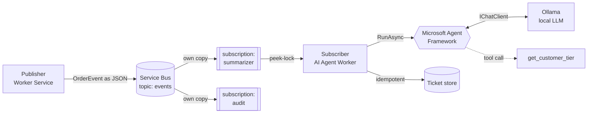

# Service Bus + AI Agent Worker (.NET)

An event-driven .NET system where two microservices communicate over **Azure Service Bus**, and the consumer is an **AI agent** that triages each event using a **local LLM** with tool calling. It runs entirely on a local machine at zero cost, using the official Service Bus emulator and [Ollama](https://ollama.com).

The goal is to demonstrate AI integrated natively into a distributed .NET system — not a separate Python script — with production-grade messaging semantics underneath it.

## Architecture



A publisher emits `OrderEvent` messages to a topic. The topic fans out to two independent subscriptions, each receiving its own copy. The subscriber consumes the `summarizer` subscription under peek-lock, runs an AI agent that calls a tool to enrich its decision, and creates a ticket exactly once per order. The `audit` subscription is left unconsumed to illustrate fan-out.

## How the agent works

The subscriber does not make a one-shot LLM call. It runs an agent (Microsoft Agent Framework) built on top of `IChatClient`. On each event the agent decides it needs the customer's support tier, invokes the `get_customer_tier` tool, receives the result, and only then produces its triage. The tool-calling loop (decide -> call -> incorporate -> respond) is managed by the framework.

## Key design decisions

- **Service Bus (a broker), not a streaming log.** Messages here are discrete commands/events that are consumed and removed, with rich per-message semantics. For high-throughput event streaming with replay, the right tool would be Event Hubs / Kafka — a deliberate distinction, not an accident.
- **A topic, not a point-to-point queue.** Multiple consumers react to the same event independently (fan-out). The publisher neither knows nor cares who listens, so new subscribers can be added without touching it.
- **Peek-lock with explicit settlement** (`AutoCompleteMessages = false`). Delivery is at-least-once; each message is locked (not deleted) until the consumer completes, dead-letters, or abandons it. A consumer that crashes mid-processing does not lose the message.
- **Idempotency on the consumer.** Because delivery is at-least-once, duplicates are a certainty, not a rare failure. The side effect (ticket creation) is guarded by a stable key — the `OrderId`, held in the handler and never routed through the LLM, so a small model can never corrupt it.
- **Dead-lettering, explicit and automatic.** Malformed messages are dead-lettered immediately with a reason; messages that repeatedly fail processing are dead-lettered automatically once the max delivery count is exceeded.
- **Shared contract via a class library + JSON body.** The event contract lives in one place (`Contracts`), referenced by both services — a single source of truth. Protobuf was deliberately not used: with one repo, one team, and one language, a shared library is the correct choice; Protobuf's natural home is gRPC.
- **AI as a justified agent, not decoration.** The agent earns the framework because it reasons and calls a tool. A bare classification would have used `IChatClient` directly. Because the agent is built on `IChatClient`, the LLM provider is swappable in a single line.
- **Local-first, zero-cost.** Service Bus emulator + Ollama, no cloud account required.

## Tech stack

- .NET 10
- Azure Service Bus (local emulator, SQL Server backend) — `Azure.Messaging.ServiceBus`
- Microsoft Agent Framework — `Microsoft.Agents.AI`
- `Microsoft.Extensions.AI` with OllamaSharp (local Ollama as the `IChatClient`)
- Docker / Docker Compose

## Project layout

- **Publisher** — Worker Service that publishes `OrderEvent`s to the topic.
- **Subscriber** — Worker Service that consumes a subscription and runs the AI agent.
- **Contracts** — class library holding the shared `OrderEvent` contract.

## Running locally

Requires Docker Desktop and Ollama with a tool-capable model (e.g. `gemma4:e2b`).

```bash
# 1. Start the Service Bus emulator (emulator + SQL Server)
cp .env.example .env          # then set a strong MSSQL_SA_PASSWORD
docker compose up -d
curl http://localhost:5300/health

# 2. Make sure a tool-capable model is available
ollama pull gemma4:e2b

# 3. Run the consumer, then publish events (two terminals)
dotnet run --project Subscriber
dotnet run --project Publisher
```

The emulator exposes AMQP on `5672` and a management/health endpoint on `5300`.

## Production notes

This is a learning-grade build. For production the following would change:

- **Idempotency store**: in-memory here; a durable store (a table with a unique constraint) or the outbox/inbox pattern in production, so it survives restarts.
- **LLM output shape**: the tool is deterministic, but free-text model output is not. A guaranteed shape needs structured output (JSON schema), which the agent supports.
- **External-call resilience**: the LLM is a slow external dependency — cold starts, client timeouts, and lock-renewal vs inference latency all need explicit handling.
- **Secrets**: the SQL password lives only in a local `.env` (git-ignored); the emulator connection string is a public development string and is safe to commit.
